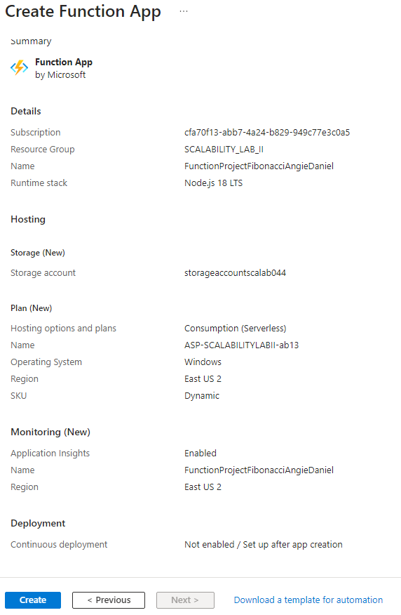
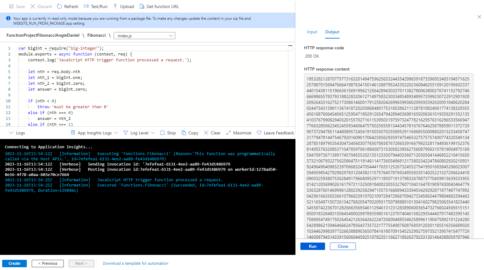
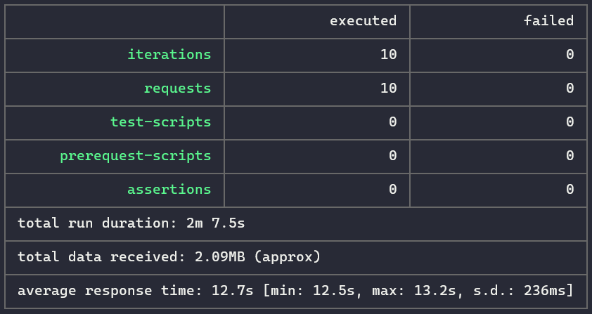
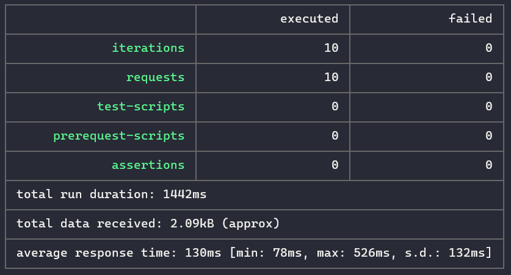
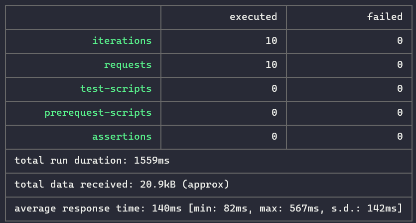
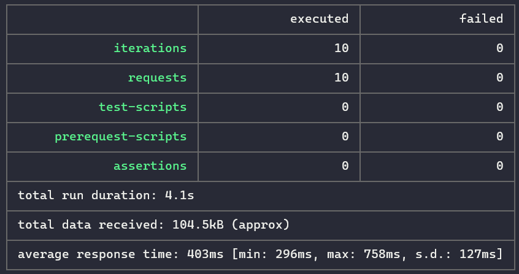
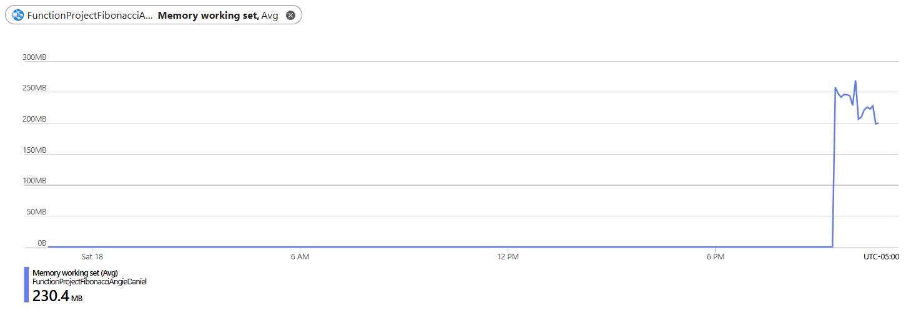
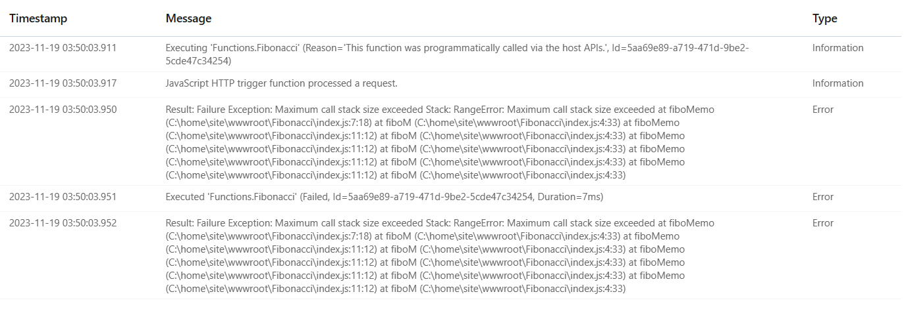

### Escuela Colombiana de Ingeniería

### Arquitecturas de Software - ARSW

### Angie Natalia Mojica - Daniel Antonio Santanilla

## Escalamiento en Azure con Maquinas Virtuales, Sacale Sets y Service Plans

### Dependencias

* Cree una cuenta gratuita dentro de Azure. Para hacerlo puede guiarse de esta [documentación](https://azure.microsoft.com/es-es/free/students/). Al hacerlo usted contará con $100 USD para gastar durante 12 meses.
Antes de iniciar con el laboratorio, revise la siguiente documentación sobre las [Azure Functions](https://www.c-sharpcorner.com/article/an-overview-of-azure-functions/)

### Parte 0 - Entendiendo el escenario de calidad

Adjunto a este laboratorio usted podrá encontrar una aplicación totalmente desarrollada que tiene como objetivo calcular el enésimo valor de la secuencia de Fibonnaci.

**Escalabilidad**
Cuando un conjunto de usuarios consulta un enésimo número (superior a 1000000) de la secuencia de Fibonacci de forma concurrente y el sistema se encuentra bajo condiciones normales de operación, todas las peticiones deben ser respondidas y el consumo de CPU del sistema no puede superar el 70%.

### Escalabilidad Serverless (Functions)

1. Cree una Function App tal cual como se muestra en las  imagenes.

    

    

    **Lo realizado:**

    Se crea un Function App

    

2. Instale la extensión de **Azure Functions** para Visual Studio Code.

    

3. Despliegue la Function de Fibonacci a Azure usando Visual Studio Code. La primera vez que lo haga se le va a pedir autenticarse, siga las instrucciones.

    

    

4. Dirijase al portal de Azure y pruebe la function.

    

    **Lo realizado:**

    Se prueba la función en el portal de Azure

    

5. Modifique la coleción de POSTMAN con NEWMAN de tal forma que pueda enviar 10 peticiones concurrentes. Verifique los resultados y presente un informe.

    Se modifica la colección de POSTMAN con NEWMAN de tal forma que pueda enviar 10 peticiones concurrentes en el archivo `Fibonacci.postman_collection.json`

    ```bash
    newman run Fibonacci.postman_collection.json -n 10
    ```

    

6. Cree una nueva Function que resuleva el problema de Fibonacci pero esta vez utilice un enfoque recursivo con memoization. Pruebe la función varias veces, después no haga nada por al menos 5 minutos. Pruebe la función de nuevo con los valores anteriores. ¿Cuál es el comportamiento?.

    ```javascript
    function fiboM(n, M) {
        return n <= 1 ? bigInt(n) : fiboMemo(n - 1, M).add(fiboMemo(n - 2, M));
    }

    function fiboMemo(n, M) {
        if (M[n] !== undefined) {
            return M[n];
        }
        M[n] = fiboM(n, M);
        return M[n];
    }
    ```

    Se relizan pruebas con los números  1000, 10000 y 50000

    1000\
    

    10000\
    

    50000\
    

    Se revisan las métricas de la función en el portal de Azure

    

    Con los valores muy grandes hay error de recursión

    

    Las respuestas de la función son más rápidas y el consumo de memoria es menor.

**Preguntas**

* ¿Qué es un Azure Function?\
    Azure Functions es un servicio en la nube disponible a petición que proporciona toda la infraestructura y los recursos, que se actualizan continuamente, necesarios para ejecutar las aplicaciones. Céntrese en el código que más le importa, en el lenguaje más productivo, y Functions se encargará del resto. Functions proporciona proceso sin servidor para Azure. Functions también se puede usar para crear API web, responder a los cambios en las bases de datos, procesar secuencias de IoT, administrar colas de mensajes, etc.\
    Azure Functions es una solución sin servidor que le permite escribir menos código, mantener menos infraestructura y ahorrar costos. En lugar de preocuparse por implementar y mantener servidores, la infraestructura en la nube proporciona todos los recursos actualizados necesarios para mantener las aplicaciones en ejecución.
* ¿Qué es serverless?\
    La computación sin servidor (o serverless para abreviar) es un modelo de ejecución en el que el proveedor en la nube (AWS, Azure o Google Cloud) es responsable de ejecutar un fragmento de código mediante la asignación dinámica de los recursos.
* ¿Qué es el runtime y que implica seleccionarlo al momento de crear el Function App?\
    El runtime de Azure Functions es el componente que ejecuta el código. Cuando se crea una Function App, seleccionar el runtime  determina el lenguaje de programación que se puede usar y las versiones de dicho lenguaje que son compatibles.

    Por ejemplo, si se elige el runtime de .NET, se podrá escribir funciones en C#, mientras que si se elige el runtime de Node.js, se podrá usar JavaScript.

    Además, la versión del runtime que se elija puede afectar a las características y a la compatibilidad con ciertas bibliotecas y frameworks.
* ¿Por qué es necesario crear un Storage Account de la mano de un Function App?

    Es necesario para el almacenamiento de archivos de la aplicación, los disparadores y enlaces, el escalado y durabilidad y los registros de ejecuciones de funciones

* ¿Cuáles son los tipos de planes para un Function App?, ¿En qué se diferencias?, mencione ventajas y desventajas de cada uno de ellos.
  * **Plan Consumo:** Cuando se usa el plan de consumo, las instancias del host de Azure Functions se agregan y quitan de forma dinámica según el número de eventos entrantes. El plan de consumo es la opción de hospedaje completamente sin servidor de Azure Functions.
  * **Plan Elastic Premium:** Functions es una opción de hospedaje de escalado dinámico para las aplicaciones de funciones.
* ¿Por qué la memoization falla o no funciona de forma correcta?

    El llamado recursivo puede ocasionar un desbordamiento de pila, y al inicio no se tienen valores en memoria por lo que es necesario calcularlos.

* ¿Cómo funciona el sistema de facturación de las Function App?

    Se factura por el tiempo de ejecución de la función, el consumo de memoria y el número de ejecuciones. El plan de consumo de Azure Functions se factura en función del consumo de recursos y las ejecuciones por segundo. 