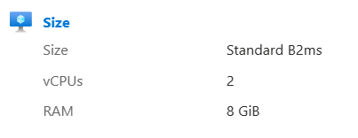
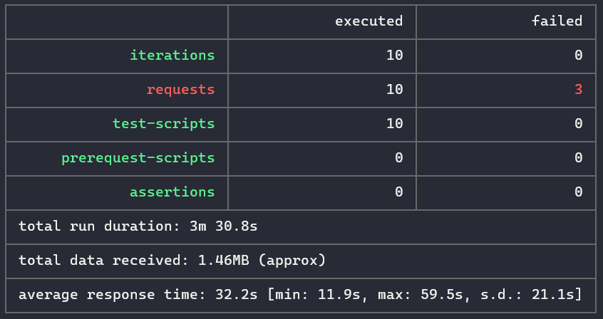

### Escuela Colombiana de Ingeniería

### Arquitecturas de Software - ARSW

### **Angie Natalia Mojica - Daniel Antonio Santanilla**

## Escalamiento en Azure con Maquinas Virtuales, Sacale Sets y Service Plans 

### Dependencias

* Cree una cuenta gratuita dentro de Azure. Para hacerlo puede guiarse de esta [documentación](https://azure.microsoft.com/es-es/free/students/). Al hacerlo usted contará con $100 USD para gastar durante 12 meses.

### Parte 0 - Entendiendo el escenario de calidad

Adjunto a este laboratorio usted podrá encontrar una aplicación totalmente desarrollada que tiene como objetivo calcular el enésimo valor de la secuencia de Fibonnaci.

**Escalabilidad**
Cuando un conjunto de usuarios consulta un enésimo número (superior a 1000000) de la secuencia de Fibonacci de forma concurrente y el sistema se encuentra bajo condiciones normales de operación, todas las peticiones deben ser respondidas y el consumo de CPU del sistema no puede superar el 70%.

### Parte 1 - Escalabilidad vertical

1. Diríjase a el [Portal de Azure](https://portal.azure.com/) y a continuación cree una maquina virtual con las características básicas descritas en la imágen 1 y que corresponden a las siguientes:
    * Resource Group = SCALABILITY_LAB
    * Virtual machine name = VERTICAL-SCALABILITY
    * Image = Ubuntu Server
    * Size = Standard B1ls
    * Username = scalability_lab
    * SSH publi key = Su llave ssh publica

    

    **Lo realizado:**

    

2. Para conectarse a la VM use el siguiente comando, donde las `x` las debe remplazar por la IP de su propia VM (Revise la sección "Connect" de la virtual machine creada para tener una guía más detallada).

    `ssh scalability_lab@xxx.xxx.xxx.xxx`

    **Lo realizado:**

    Se ejecuta el siguiente comando para conectarse a la VM:

    ```bash
    ssh -i VERTICAL-SCALABILITY_key.pem scalability_lab@172.200.71.211
    ```

3. Instale node, para ello siga la sección *Installing Node.js and npm using NVM* que encontrará en este [enlace](https://linuxize.com/post/how-to-install-node-js-on-ubuntu-18.04/).

    **Lo realizado:**

    Se ejecuta los siguientes comandos para instalar node:

    ```bash
    sudo apt update
    sudo apt install nodejs
    ```

4. Para instalar la aplicación adjunta al Laboratorio, suba la carpeta `FibonacciApp` a un repositorio al cual tenga acceso y ejecute estos comandos dentro de la VM:

    ```bash
    git clone https://github.com/An6ie02/ARSW_LAB9.git1
    cd ARSW_LAB9/FibonacciApp
    npm install
    ```

5. Para ejecutar la aplicación puede usar el comando `npm FibonacciApp.js`, sin embargo una vez pierda la conexión ssh la aplicación dejará de funcionar. Para evitar ese compartamiento usaremos *forever*. Ejecute los siguientes comando dentro de la VM.

    ```bash
    node FibonacciApp.js
    ```

6. Antes de verificar si el endpoint funciona, en Azure vaya a la sección de *Networking* y cree una *Inbound port rule* tal como se muestra en la imágen. Para verificar que la aplicación funciona, use un browser y user el endpoint `http://xxx.xxx.xxx.xxx:3000/fibonacci/6`. La respuesta debe ser `The answer is 8`.

    

    **Lo realizado:**

    Se verifica que este la regla de entrada

    

    Se prueba la aplicación en el navegador

    

7. La función que calcula en enésimo número de la secuencia de Fibonacci está muy mal construido y consume bastante CPU para obtener la respuesta. Usando la consola del Browser documente los tiempos de respuesta para dicho endpoint usando los siguintes valores:
    * 1000000
    * 1010000
    * 1020000
    * 1030000
    * 1040000
    * 1050000
    * 1060000
    * 1070000
    * 1080000
    * 1090000

    **Lo realizado:**

    

8. Dírijase ahora a Azure y verifique el consumo de CPU para la VM. (Los resultados pueden tardar 5 minutos en aparecer).

    

    **Lo realizado:**

    

9. Ahora usaremos Postman para simular una carga concurrente a nuestro sistema. Siga estos pasos.
    * Instale newman con el comando `npm install newman -g`. Para conocer más de Newman consulte el siguiente [enlace](https://learning.getpostman.com/docs/postman/collection-runs/command-line-integration-with-newman/).
    * Diríjase hasta la ruta `FibonacciApp/postman` en una maquina diferente a la VM.
    * Para el archivo `[ARSW_LOAD-BALANCING_AZURE].postman_environment.json` cambie el valor del parámetro `VM1` para que coincida con la IP de su VM.
    * Ejecute el siguiente comando.

    ```bash
    newman run ARSW_LOAD-BALANCING_AZURE.postman_collection.json -e [ARSW_LOAD-BALANCING_AZURE].postman_environment.json -n 10 &
    newman run ARSW_LOAD-BALANCING_AZURE.postman_collection.json -e [ARSW_LOAD-BALANCING_AZURE].postman_environment.json -n 10
    ```

    **Lo realizado:**

    Se instalo newman con el siguiente comando:

    ```bash
    npm install -g newman
    ```

    Se cambió el valor del parámetro VM1

    ```json
    "key": "VM1",
    "value": "172.200.71.211",
    "enabled": true
    ```

10. La cantidad de CPU consumida es bastante grande y un conjunto considerable de peticiones concurrentes pueden hacer fallar nuestro servicio. Para solucionarlo usaremos una estrategia de Escalamiento Vertical. En Azure diríjase a la sección *size* y a continuación seleccione el tamaño `B2ms`.

    

    **Lo realizado:**

    Se cambió el tamaño de la VM a B2ms

    

11. Una vez el cambio se vea reflejado, repita el paso 7, 8 y 9.

    **Lo realizado:**

    

    

    

12. Evalue el escenario de calidad asociado al requerimiento no funcional de escalabilidad y concluya si usando este modelo de escalabilidad logramos cumplirlo.

    **Lo realizado:**

    Sí, ya que al aumentar el tamaño de la VM, se aumenta la cantidad de CPU y memoria RAM, por lo que la aplicación puede procesar más peticiones en menos tiempo.

13. Vuelva a dejar la VM en el tamaño inicial para evitar cobros adicionales.

**Preguntas**

1. ¿Cuántos y cuáles recursos crea Azure junto con la VM?

    Azure junto con la VM crea 6 recursos adicionales que son:

    

2. ¿Brevemente describa para qué sirve cada recurso?

    **Public Ip address:** Las direcciones IP públicas permiten que los recursos de Azure se comuniquen con Internet y con los servicios públicos de Azure. Dedicas la dirección al recurso (VM) hasta que lo desasignas.

    **Network security group:** Puede usar un grupo de seguridad de red de Azure para filtrar el tráfico de red hacia y desde los recursos de Azure en una red virtual de Azure. Un grupo de seguridad de red contiene reglas de seguridad que permiten o deniegan el tráfico de red entrante o el tráfico de red saliente desde varios tipos de recursos de Azure. Para cada regla, puede especificar origen y destino, puerto y protocolo.

    **Virtual Network:** Azure Virtual Network es un servicio que proporciona el componente fundamental para su red privada en Azure. Una instancia del servicio (una red virtual) permite que muchos tipos de recursos de Azure se comuniquen de forma segura entre sí, con Internet y con las redes locales. Estos recursos de Azure incluyen máquinas virtuales (VM).

    Una red virtual es similar a una red tradicional que operaría en su propio centro de datos. Pero aporta beneficios adicionales de la infraestructura de Azure, como escala, disponibilidad y aislamiento.

    **Network Interface:** Una interfaz de red (NIC) permite que una máquina virtual (VM) de Azure se comunique con Internet, Azure y recursos locales. Una máquina virtual que crea en Azure Portal tiene una NIC con la configuración predeterminada.

    **SSH Key:** Las SSH key se usan para conectarse a máquinas virtuales (VM) en Azure.

    **Disk:** Los discos administrados de Azure son volúmenes de almacenamiento a nivel de bloque administrados por Azure y utilizados con Azure Virtual Machines. Los discos administrados son como un disco físico en un servidor local pero virtualizados. Con los discos administrados, todo lo que tiene que hacer es especificar el tamaño del disco, el tipo de disco y aprovisionarlo. Una vez que aprovisiona el disco, Azure se encarga del resto.

3. ¿Al cerrar la conexión ssh con la VM, por qué se cae la aplicación que ejecutamos con el comando `npm FibonacciApp.js`? ¿Por qué debemos crear un *Inbound port rule* antes de acceder al servicio?

    El comando npm FibonacciApp.js inicia un proceso que solo funciona si hay una conexión activa. Si la conexión se cierra, la aplicación se cierra y deja de funcionar.

    Debemos crear un Inbound port rule para permitir el tráfico de entrada al puerto 3000, ya que por defecto Azure no permite el tráfico de entrada a ningún puerto, y este es necesario para que la aplicación funcione.

4. Adjunte tabla de tiempos e interprete por qué la función tarda tando tiempo.

    La aplicación tarda tanto porque se calculan todos los números de la secuencia de Fibonacci hasta el número que se desea calcular, y esto toma mucho tiempo.

    **Antes del escalamiento:**

    

    **Después del escalamiento:**

    

5. Adjunte imágen del consumo de CPU de la VM e interprete por qué la función consume esa cantidad de CPU.

    La función consume esa cantidad de CPU porque se calculan todos los números de la secuencia de Fibonacci hasta el número que se desea calcular, y esto necesita muchos recursos de CPU.

    **Antes del escalamiento:**

    

    **Después del escalamiento:**

    

    **Gráfica completa:** (El punto en la gráfica es el momento en el que se realizó el escalamiento)

    

6. Adjunte la imagen del resumen de la ejecución de Postman. Interprete:
    * Tiempos de ejecución de cada petición.

        **Antes del escalamiento:**

        

        **Después del escalamiento:**

        

    * Si hubo fallos documentelos y explique.

        El error ECONNRESET significa que la conexión TCP en su cliente Postman fue cerrada inesperadamente por el servidor o algún intermediario como un proxy. En el contexto de su prueba de Postman, parece que la solicitud a la API "fibonacci" en la iteración 2 fue interrumpida antes de que pudiera completarse.

        Este error puede ser causado por varias razones, como un servidor que se cierra inesperadamente, un tiempo de espera de la conexión, problemas de red, etc. Para solucionarlo, puede necesitar investigar el servidor y la red en la que se está ejecutando.

        

7. ¿Cuál es la diferencia entre los tamaños `B2ms` y `B1ls` (no solo busque especificaciones de infraestructura)?

    Las VM de la serie B se pueden implementar en diversos tipos de hardware y procesadores, por lo que se proporciona una asignación de ancho de banda competitiva. La serie B se ejecuta en procesadores de 3.ª generación Intel® Xeon® (Ice Lake), Intel® Xeon® (Cascade Lake), Intel® Xeon® (Skylake), Intel® Xeon® (Broadwell) o Intel® Xeon® (Haswell).

    Las VM de la serie B son idóneas para cargas de trabajo que no necesitan un rendimiento completo de la CPU de forma continua, como los servidores web, las pruebas de concepto, las bases de datos pequeñas y los entornos de compilación de desarrollo. Estas cargas de trabajo suelen necesitar unos requisitos de rendimiento ampliables.

    La serie B incluye los siguientes tamaños de máquina virtual:

     * Unidad de proceso de Azure (ACU): varía.*
     * Premium Storage: Compatible
     * Almacenamiento en caché de Premium Storage: No compatible
     * Migración en vivo: Compatible
     * Actualizaciones con conservación de memoria: Compatible
     * Compatibilidad con generación de VM: Generación 1 y 2
     * Redes aceleradas: Compatible \*\*
     * Discos de sistema operativo efímero: Compatible
     * Virtualización anidada: no compatible

    | Característica | Standard_B1ls | Standard_B1ms |
    |---|---|---|
    | **vCPU** | 1 | 1 |
    | **Memoria: GiB** | 0.5 | 2 |
    | **GiB de almacenamiento temporal (SSD)** | 4 | 4 |
    | **Rendimiento de CPU base de la máquina virtual (%)** | 10 | 40 |
    | **Créditos iniciales** | 30 | 30 |
    | **Créditos ingresados/hora** | 72 | 12 |
    | **Créditos máximos ingresados** | 72 | 288 |
    | **Discos de datos máx.** | 2 | 2 |
    | **Rendimiento máximo del disco sin almacenamiento en la caché: IOPS/Mbps** | 160/10 | 640/10 |
    | **Rendimiento máximo del disco sin almacenamiento en la caché expandido: IOPS/MBps1** | 4000/100 | 4000/100 |
    | **Nº máx. NIC** | 2 | 2 |

8. ¿Aumentar el tamaño de la VM es una buena solución en este escenario?, ¿Qué pasa con la FibonacciApp cuando cambiamos el tamaño de la VM?

    No, porque el aumento del tamaño de la VM no es una solución escalable, ya que si se aumenta el número de peticiones, la VM no podrá procesarlas todas y se volverá a tener el mismo problema de consumo de CPU.

    Cuando se cambia el tamaño de la VM, la aplicación deja de funcionar y se debe volver a ejecutar.

9. ¿Qué pasa con la infraestructura cuando cambia el tamaño de la VM? ¿Qué efectos negativos implica?

    

    Al cambiar el tamaño de la VM, se debe reiniciar la máquina, por lo que se pierde la conexión ssh y la aplicación deja de funcionar.

10. ¿Hubo mejora en el consumo de CPU o en los tiempos de respuesta? Si/No ¿Por qué?

    Sí, porque al aumentar el tamaño de la VM, se aumenta la cantidad de CPU y memoria RAM, por lo que la aplicación puede procesar más peticiones en menos tiempo.

11. Aumente la cantidad de ejecuciones paralelas del comando de postman a `4`. ¿El comportamiento del sistema es porcentualmente mejor?

    El comportamiento es porcentualmente mejor porque se pueden procesar más peticiones en menos tiempo. Ésto se puede ver en el punto de la siguiente gráfica de consumo de CPU.

    

    

### Parte 2 - Escalabilidad horizontal

#### Crear el Balanceador de Carga

Antes de continuar puede eliminar el grupo de recursos anterior para evitar gastos adicionales y realizar la actividad en un grupo de recursos totalmente limpio.

1. El Balanceador de Carga es un recurso fundamental para habilitar la escalabilidad horizontal de nuestro sistema, por eso en este paso cree un balanceador de carga dentro de Azure tal cual como se muestra en la imágen adjunta.

    

2. A continuación cree un *Backend Pool*, guiese con la siguiente imágen.

    

3. A continuación cree un *Health Probe*, guiese con la siguiente imágen.

    

4. A continuación cree un *Load Balancing Rule*, guiese con la siguiente imágen.

    

5. Cree una *Virtual Network* dentro del grupo de recursos, guiese con la siguiente imágen.

    

#### Crear las maquinas virtuales (Nodos)

Ahora vamos a crear 3 VMs (VM1, VM2 y VM3) con direcciones IP públicas standar en 3 diferentes zonas de disponibilidad. Después las agregaremos al balanceador de carga.

1. En la configuración básica de la VM guíese por la siguiente imágen. Es importante que se fije en la "Avaiability Zone", donde la VM1 será 1, la VM2 será 2 y la VM3 será 3.

    

2. En la configuración de networking, verifique que se ha seleccionado la *Virtual Network*  y la *Subnet* creadas anteriormente. Adicionalmente asigne una IP pública y no olvide habilitar la redundancia de zona.

    

3. Para el Network Security Group seleccione "avanzado" y realice la siguiente configuración. No olvide crear un *Inbound Rule*, en el cual habilite el tráfico por el puerto 3000. Cuando cree la VM2 y la VM3, no necesita volver a crear el *Network Security Group*, sino que puede seleccionar el anteriormente creado.

    

4. Ahora asignaremos esta VM a nuestro balanceador de carga, para ello siga la configuración de la siguiente imágen.

    

5. Finalmente debemos instalar la aplicación de Fibonacci en la VM. para ello puede ejecutar el conjunto de los siguientes comandos, cambiando el nombre de la VM por el correcto

    ```bash
    git clone https://github.com/daprieto1/ARSW_LOAD-BALANCING_AZURE.git

    curl -o- https://raw.githubusercontent.com/creationix/nvm/v0.34.0/install.sh | bash
    source /home/vm1/.bashrc
    nvm install node

    cd ARSW_LOAD-BALANCING_AZURE/FibonacciApp
    npm install

    npm install forever -g
    forever start FibonacciApp.js
    ```

Realice este proceso para las 3 VMs, por ahora lo haremos a mano una por una, sin embargo es importante que usted sepa que existen herramientas para aumatizar este proceso, entre ellas encontramos Azure Resource Manager, OsDisk Images, Terraform con Vagrant y Paker, Puppet, Ansible entre otras.

#### Probar el resultado final de nuestra infraestructura

1. Porsupuesto el endpoint de acceso a nuestro sistema será la IP pública del balanceador de carga, primero verifiquemos que los servicios básicos están funcionando, consuma los siguientes recursos:

    ```bash
    http://52.155.223.248/
    http://52.155.223.248/fibonacci/1
    ```

    **Lo realizado:**

    Se verifica que el balanceador de carga esté funcionando

    

    Se verifica que la aplicación esté funcionando

    

2. Realice las pruebas de carga con `newman` que se realizaron en la parte 1 y haga un informe comparativo donde contraste: tiempos de respuesta, cantidad de peticiones respondidas con éxito, costos de las 2 infraestrucruras, es decir, la que desarrollamos con balanceo de carga horizontal y la que se hizo con una maquina virtual escalada.

    Se realizan las pruebas de carga con newman

    

    El rendimiento de las máquinas virtuales con el balanceo de carga es mejor que el rendimiento de las máquinas virtuales con escalamiento vertical, ya que las máquinas virtuales con el balanceo de carga procesan más peticiones en menos tiempo.

    **Máquina virtual 1:**

    

    **Máquina virtual 2:**

    

3. Agregue una 4 maquina virtual y realice las pruebas de newman, pero esta vez no lance 2 peticiones en paralelo, sino que incrementelo a 4. Haga un informe donde presente el comportamiento de la CPU de las 4 VM y explique porque la tasa de éxito de las peticiones aumento con este estilo de escalabilidad.

    ```bash
    newman run ARSW_LOAD-BALANCING_AZURE.postman_collection.json -e [ARSW_LOAD-BALANCING_AZURE].postman_environment.json -n 10 &
    newman run ARSW_LOAD-BALANCING_AZURE.postman_collection.json -e [ARSW_LOAD-BALANCING_AZURE].postman_environment.json -n 10 &
    newman run ARSW_LOAD-BALANCING_AZURE.postman_collection.json -e [ARSW_LOAD-BALANCING_AZURE].postman_environment.json -n 10 &
    newman run ARSW_LOAD-BALANCING_AZURE.postman_collection.json -e [ARSW_LOAD-BALANCING_AZURE].postman_environment.json -n 10
    ```

    **Lo realizado:**

    No se puedo agregar una cuarta máquina virtual porque se excedió el límite de recursos de la suscripción.

    La tasa de éxito de las peticiones aumentó porque al aumentar el número de máquinas virtuales, se duplica la cantidad de CPU y memoria RAM, por lo que la aplicación puede procesar más peticiones en menos tiempo.

    

    **Máquina virtual 1:**

    

    **Máquina virtual 2:**

    

**Preguntas**

* ¿Cuáles son los tipos de balanceadores de carga en Azure y en qué se diferencian?, ¿Qué es SKU, qué tipos hay y en qué se diferencian?, ¿Por qué el balanceador de carga necesita una IP pública?

    **Tipos de balanceadores de carga en Azure:**

    **Azure Front Door:** es una red de entrega de aplicaciones que proporciona equilibrio de carga global y un servicio de aceleración de sitios para las aplicaciones web. Ofrece funcionalidades de capa 7 para la aplicación, como la descarga SSL, el enrutamiento basado en rutas, la conmutación por error rápida y el almacenamiento en caché para mejorar el rendimiento y la alta disponibilidad de las aplicaciones.

    **Traffic Manager:** es un equilibrador de carga de tráfico basado en DNS que le permite distribuir el tráfico de forma óptima a servicios de regiones de Azure globales, al tiempo que proporciona una alta disponibilidad y capacidad de respuesta. Dado que Traffic Manager es un servicio de equilibrio de carga basado en DNS, solo equilibra la carga en el nivel del dominio. Por ese motivo, no puede conmutar por error tan rápidamente como con Azure Front Door, debido a los desafíos comunes relacionados con el almacenamiento en caché de DNS y a los sistemas que no respetan los TTL de DNS.

    **Application Gateway:** proporciona un controlador de entrega de aplicaciones como servicio, que ofrece diversas funcionalidades de equilibrio de carga de capa 7. Úselo para optimizar la productividad de las granjas de servidores web al traspasar la carga de la terminación SSL con mayor actividad de la CPU a la puerta de enlace.

    **Load Balancer:** proporciona un servicio de equilibrio de carga de capa 4 con latencia muy baja y alto rendimiento (entrante y saliente) para todos los protocolos UDP y TCP. Se diseñó para administrar millones de solicitudes por segundo, a la vez que garantiza que la solución tiene una alta disponibilidad. Load Balancer tiene redundancia de zona, lo que asegura una alta disponibilidad en todas las zonas de disponibilidad. Admite una topología de implementación regional y una topología entre regiones.

* ¿Cuál es el propósito del *Backend Pool*?

    El propósito de un **backend pool** es proporcionar un grupo de recursos de backend que se pueden asignar a las solicitudes de los usuarios. Los backend pools se utilizan a menudo para escalar el rendimiento de una aplicación web o API, también pueden utilizarse para mejorar la disponibilidad de una aplicación. Si un recurso de backend falla, otro recurso del pool puede tomar su lugar. Esto ayuda a garantizar que la aplicación siga siendo accesible para los usuarios Esto permite que la aplicación se escala de forma automática para satisfacer la demanda de los usuarios.

* ¿Cuál es el propósito del *Health Probe*?

    El propósito del **Health Probe** es determinar el estado de salud de un servicio. Los Health Probes se utilizan a menudo en sistemas distribuidos para garantizar que los servicios estén disponibles y funcionando correctamente. Envía solicitudes a las instancias de backend, verificando sus respuestas y asegurándose de que estén en un estado saludable. Si una instancia no cumple con los criterios establecidos, el balanceador de carga puede excluir temporalmente esa instancia del tráfico, contribuyendo así a la escalabilidad dinámica y optimizando el rendimiento general del sistema

* ¿Cuál es el propósito de la *Load Balancing Rule*? ¿Qué tipos de sesión persistente existen, por qué esto es importante y cómo puede afectar la escalabilidad del sistema?.

    El propósito de la **Load Balancing Rule** es determinar cómo se distribuyen las solicitudes de los usuarios entre los recursos de backend de un pool de backend. Las reglas de balanceo de carga se utilizan a menudo para mejorar el rendimiento, la disponibilidad y la seguridad de las aplicaciones web y las API.

* ¿Qué es una *Virtual Network*? ¿Qué es una *Subnet*? ¿Para qué sirven los *address space* y *address range*?

    La **Virtual Network** de Azure permite que muchos tipos de recursos de Azure, como Azure Virtual Machines (VM), se comuniquen de forma segura entre sí, con Internet y con las redes local. Esta VNet ofrece conectividad directa a los recursos de Azure a través de una ruta optimizada a través de la red troncal de Azure. Los recursos de Azure se pueden implementar dentro de una Vnet o se pueden asociar a la Vnet mediante puntos de conexión privados o de servicio.

    Una **subnet**, o subred, es una división lógica de una red IP. Las subredes se utilizan para organizar las redes IP en segmentos más pequeños, lo que puede mejorar el rendimiento, la seguridad y la administración de la red.

    **Address space** es el conjunto de direcciones IP que se pueden utilizar en una red. El address space se divide en bloques de direcciones, que se denominan subnets.

    **Address range** es un subconjunto de un address space. Un address range se utiliza para asignar direcciones IP a los dispositivos de una red.

* ¿Qué son las *Availability Zone* y por qué seleccionamos 3 diferentes zonas?. ¿Qué significa que una IP sea *zone-redundant*?

    En Azure, una **Availability Zone** (AZ) es un centro de datos físico aislado dentro de una región de Azure. Las AZs están diseñadas para ser independientes entre sí, con su propia infraestructura de alimentación, refrigeración y red. Esto significa que si una AZ experimenta una interrupción, las demás AZs de la región seguirán estando disponibles.

    Elegir 3 AZs diferentes proporciona una mayor tolerancia a fallos. Si una AZ experimenta una interrupción, los recursos de Azure que se encuentran en las otras dos AZs seguirán estando disponibles. Esto ayuda a garantizar que los recursos de Azure estén disponibles para los usuarios incluso en caso de interrupción.

    En Azure, una IP **zone-redundant** es una dirección IP que está disponible en dos o más AZs de una región. Esto significa que si una AZ experimenta una interrupción, la IP seguirá estando disponible en otra AZ.

    Las IPs zone-redundant son importantes para la alta disponibilidad porque ayudan a garantizar que las aplicaciones y los servicios estén disponibles incluso si una AZ experimenta una interrupción.

* ¿Cuál es el propósito del *Network Security Group*?

    En Azure, un **Network Security Group** (NSG) es un grupo de reglas de seguridad que se aplican a una subred de Azure. Las reglas de NSG controlan el tráfico de red que puede entrar y salir de la subred.

    Los NSG son una herramienta importante para la seguridad de la red en Azure. Pueden ayudar a proteger los recursos de Azure de ataques de red, como el tráfico malicioso o el tráfico no autorizado.

* Informe de newman 1 (Punto 2)

   | Métrica                | Escalamiento Vertical       | Escalamiento Horizontal     |
   |------------------------|-----------------------------|-----------------------------|
   | Tiempos de Respuesta   |          22.1 s             |        12.8 s               |
   | Cantidad de Peticiones |  3 peticiones paralelas     |   3 peticiones paralelas    |
   | Uso de CPU             |         50,3%              |    97% VM1 y 93% VM2         |

* Presente el Diagrama de Despliegue de la solución.

    
